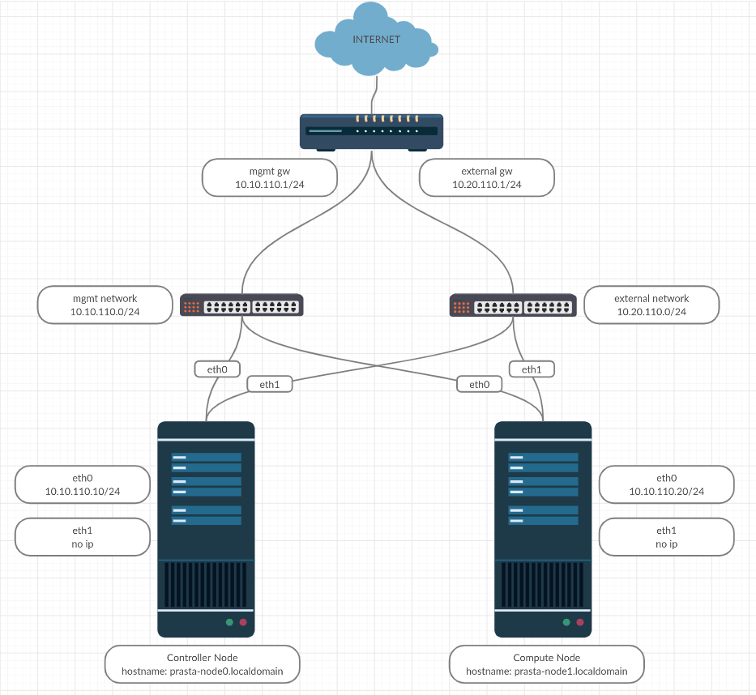

# Research: Testing Octavia On CentOs 8 Using Kolla-Ansible

Openstack Core + Octavia Deployment __Train__

## Prerequisites
- 2 physical machine or Vm installed Centos 8
- 2 interfaces on each vm (mgmt network and external network)
- Internet access on both networks

## Topology


## Installation Steps

**Run All commands below only on Controller Node or Deployer Node**

**Run commands with Regular users (non-root)**

### 1. Install Dependencies

```
sudo dnf install python3-devel libffi-devel gcc openssl-devel python3-libselinux
```

### 2. Create Virtual Environtment

```
sudo dnf install python3-virtualenv 
```

```
cd ~
virtualenv kolla-install
source kolla-install/bin/activate
```

### 3. Install Dependencies On Virtual Environtment

```
pip install -U pip
pip install ansible==2.9.10
pip install kolla-ansible==9.2.0
```

### 4. Create __/etc/kolla/__ Directory

```
sudo mkdir -p /etc/kolla
sudo chown $USER:$USER /etc/kolla
```

### 5. Copy globals.yml and passwords.yml to /etc/kolla directory

```
cp -r kolla-install/share/kolla-ansible/etc_examples/kolla/* /etc/kolla
```

### 6. Copy all-in-one and multinode inventory files to the current directory.

```
cp kolla-install/share/kolla-ansible/ansible/inventory/* .
```

### 7. Configure Ansible

```
sudo mkdir -p /etc/ansible
```

```
sudo nano /etc/ansible/ansible.cfg

[defaults]
host_key_checking=False
pipelining=True
forks=100
```

### 8. Configure __/etc/hosts__ 
```
sudo nano /etc/hosts

127.0.0.1 localhost
::1         localhost localhost.localdomain localhost6 localhost6.localdomain6

10.10.110.10 controller
10.10.110.20 compute
```
Make sure you can ping __controller__ and __compute__

### 9. SSH Without Password
```
ssh-keygen
ssh-copy-id -i ~/.ssh/id_rsa.pub $USER@compute
```

### 10. Configure Multinode Inventory

Make changes to several sections as below

```
nano ~/multinode

[control]
controller

[network]
controller

[compute]
compute

[monitoring]
controller

[storage]
controller

[deployment]
controller       ansible_connection=local
```

__Do not make changes in other parts__

### 11. Test Ansible Connectivity

```
ansible -i multinode all -m ping
```

### 12. Generate Password

```
kolla-genpwd
```

### 13. Configure __globals.yml__

Uncoment and Make changes to several sections as below

```
nano /etc/kolla/globals.yml

kolla_base_distro: "centos"
kolla_install_type: "source"
openstack_release: "train"
kolla_internal_vip_address: "10.10.110.11"
kolla_external_vip_address: "10.10.110.12"
network_interface: "eth0"
neutron_external_interface: "eth1"
enable_neutron_provider_networks: "yes"
nova_compute_virt_type: "kvm"
enable_octavia: "yes"
```
__Do not make changes in other parts__

### 14. Generate Certificate for Octavia Amphora

Manual configuration (Recommended), follow this [step](certificates/octavia-cert-manual.md)

Using Script (For Testing) follow this [step](certificates/octavia-cert-script.md)


### 15. Deploy using Kolla-ansible

```
kolla-ansible -i ./multinode bootstrap-servers
kolla-ansible -i ./multinode prechecks
kolla-ansible -i ./multinode deploy
```

### 16. Post Deploy

```
kolla-ansible post-deploy
pip install python-openstackclient
```

### 17. Create octavia openrc file

Check octavia keystone password
```
grep octavia_keystone /etc/kolla/passwords.yml 

octavia_keystone_password: VQ2vA5AsFZLzt1t1FK39sMMu2R5BXMSSXtIXOWow
```

Create /etc/kolla/octavia-openrc.sh
```
sudo nano /etc/kolla/octavia-openrc.sh

for key in $( set | awk '{FS="="}  /^OS_/ {print $1}' ); do unset $key ; done
export OS_PROJECT_DOMAIN_NAME=Default
export OS_USER_DOMAIN_NAME=Default
export OS_PROJECT_NAME=admin
export OS_TENANT_NAME=admin
export OS_USERNAME=octavia
export OS_PASSWORD=VQ2vA5AsFZLzt1t1FK39sMMu2R5BXMSSXtIXOWow
export OS_AUTH_URL=http://10.10.110.11:35357/v3
export OS_INTERFACE=internal
export OS_ENDPOINT_TYPE=internalURL
export OS_IDENTITY_API_VERSION=3
export OS_REGION_NAME=RegionOne
export OS_AUTH_PLUGIN=password
```

source to /etc/kolla/octavia-openrc.sh
```
source /etc/kolla/octavia-openrc.sh
```

### 18. Create Amphora Image

Install Dependencies
```
sudo dnf -y install epel-release
sudo dnf install -y debootstrap qemu-img git e2fsprogs policycoreutils-python-utils
```

Clone octavia repository
```
git clone https://opendev.org/openstack/octavia -b stable/train
```

Install disk-builder
```
python3 -m venv disk-builder
source disk-builder/bin/activate
pip install diskimage-builder
```

Create Amphora Image (Default using ubuntu)
```
cd octavia/diskimage-create
./diskimage-create.sh
```

### 19. Register the image in Glance

```
source ~/kolla-install/bin/activate
```

```
openstack image create amphora-x64-haproxy.qcow2 --container-format bare --disk-format qcow2 --private --tag amphora --file amphora-x64-haproxy.qcow2
```

### 20. Create Amphora Flavor

```
openstack flavor create --vcpus 1 --ram 1024 --disk 2 "amphora" --private
```

### 21. Create Amphora Security Group

```
openstack security group create lb-mgmt-sec-grp
openstack security group rule create --protocol icmp lb-mgmt-sec-grp
openstack security group rule create --protocol tcp --dst-port 22 lb-mgmt-sec-grp
openstack security group rule create --protocol tcp --dst-port 9443 lb-mgmt-sec-grp
```

### 22. Create Amphora Keypair

```
openstack keypair create --public-key ~/.ssh/id_rsa.pub octavia_ssh_key
```

### 23. Create Amphora Management Network

```
sudo docker exec -it openvswitch_vswitchd bash
dnf -y install python3-pip
pip3 install python-neutronclient
```

Define Variable

```
OCTAVIA_MGMT_SUBNET=172.16.0.0/12
OCTAVIA_MGMT_SUBNET_START=172.16.0.100
OCTAVIA_MGMT_SUBNET_END=172.16.31.254
```

Create octavia-openrc.sh_

```
vi octavia-openrc.sh

for key in $( set | awk '{FS="="}  /^OS_/ {print $1}' ); do unset $key ; done
export OS_PROJECT_DOMAIN_NAME=Default
export OS_USER_DOMAIN_NAME=Default
export OS_PROJECT_NAME=admin
export OS_TENANT_NAME=admin
export OS_USERNAME=octavia
export OS_PASSWORD=VQ2vA5AsFZLzt1t1FK39sMMu2R5BXMSSXtIXOWow
export OS_AUTH_URL=http://10.10.110.11:35357/v3
export OS_INTERFACE=internal
export OS_ENDPOINT_TYPE=internalURL
export OS_IDENTITY_API_VERSION=3
export OS_REGION_NAME=RegionOne
export OS_AUTH_PLUGIN=password
```
Source octavia-openrc.sh_

```
source octavia-openrc.sh
```

Create Network

```
OCTAVIA_AMP_NETWORK_ID=$(neutron net-create lb-mgmt-net | awk '/ id / {print $4}')

neutron subnet-create --name lb-mgmt-subnet --allocation-pool start=$OCTAVIA_MGMT_SUBNET_START,end=$OCTAVIA_MGMT_SUBNET_END lb-mgmt-net $OCTAVIA_MGMT_SUBNET
```

Create Port

```
neutron port-create --name octavia-port --binding:host_id=$HOSTNAME lb-mgmt-net
MGMT_PORT_ID=$(neutron port-show octavia-port | awk '/ id / {print $4}')
MGMT_PORT_MAC=$(neutron port-show octavia-port | awk '/ mac_address / {print $4}')
```
Assign port into controller node

```
sudo ovs-vsctl -- --may-exist add-port br-int octavia-int -- set Interface octavia-int type=internal -- set Interface octavia-int external-ids:iface-status=active -- set Interface octavia-int external-ids:attached-mac=$MGMT_PORT_MAC -- set Interface octavia-int external-ids:iface-id=$MGMT_PORT_ID

sudo ip link set dev octavia-int address $MGMT_PORT_MAC
sudo dhclient octavia-int; ip r del default via 172.16.0.1 dev octavia-int
```

### 24. Add the octavia resource id into globals.yml

out of the docker (bask to regular user)

```
(openvswitch-vswitchd)[root@prasta-node0 /]# exit
(kolla-install) [prasta@prasta-node0 diskimage-create]$ cd ~
(kolla-install) [prasta@prasta-node0 ~]$ 
```

Check octavia resource id 
```
openstack network show lb-mgmt-net | awk '/ id / {print $4}'
openstack security group show lb-mgmt-sec-grp | awk '/ id / {print $4}'
openstack flavor show amphora | awk '/ id / {print $4}'
```
Add the octavia resource id into globals.yml

```
nano /etc/kolla/globals.yml

octavia_amp_boot_network_list: <ID of lb-mgmt-net>
octavia_amp_secgroup_list: <ID of lb-mgmt-sec-grp>
octavia_amp_flavor_id: <ID of amphora flavor>
```

### 25. Reconfigure Octavia

```
kolla-ansible reconfigure -t octavia
```

### 26. Openstack Resource Create Using CLI (Optional)

[step](openstack-resource-cli.md)
